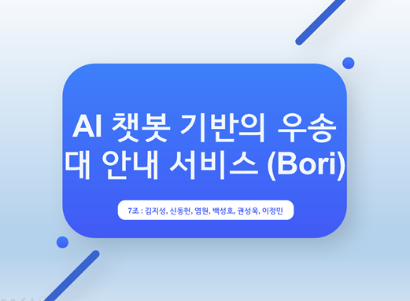
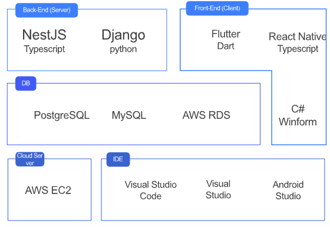
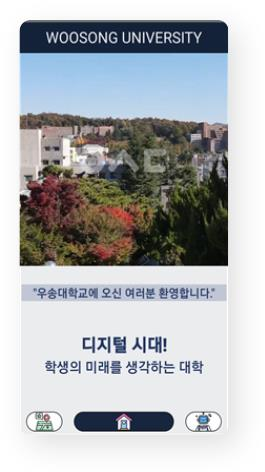
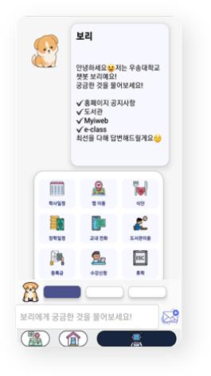
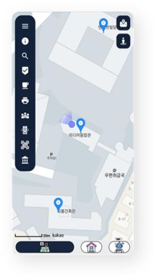
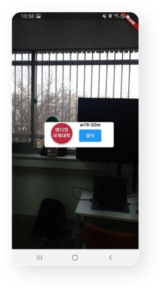
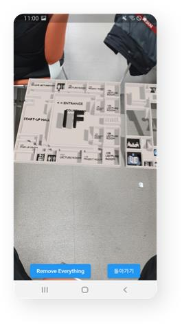
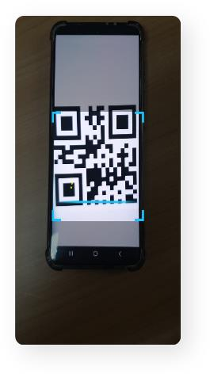
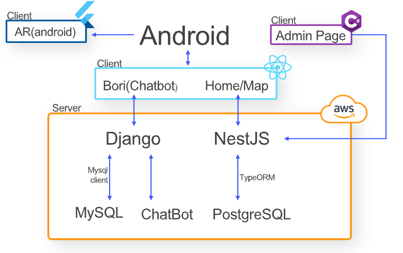

# 우송대 안내 서비스 Bori

   
  
   

# 시연영상

[시연영상](https://drive.google.com/file/d/1eI8wDaVLkFHD3TvB2lhorU7VeUC5Rgv9/view?usp=share_link)

# 목차

1. 프로젝트 소개
2. 팀원 소개
3. 설계의 주안점
4. 개발 환경
5. 구현 기능 
6. 구조도
7. 느낀 점 & 배운 

## 프로젝트 소개

“학교의 시설 및 학사일정을 편하게 확인하자”

우송대학교 학생들의 설문조사를 토대로 조사한 결과 학교 시설의 대한 정보 및 학사일정을
찾는 과정이 간편하지 않다는 문제점이 존재한다. “Bori”서비스는 이러한 문제점을 해결한다.

우송대학교 안내 서비스인 “Bori”는 사용자가 질문하면
학습된 정보를 통해 답변하는 AI 기반의 서비스로
언제든지 내가 원하는 시설의 정보나 학사일정 등을 얻을 수 있다.

또한 시작 화면을 통해 우송대학교 소식 등을 확인할 수 있고 지도 페이지를 통해
우송대학교 시설들을 한 눈에 볼 수 있으며 AR을 통해 건물과 내 사이의 대략적인 거리를 알 수 있고 건물의 층별 안내도를 AR로 확인할 수 있다.

## 팀원 소개

팀원 소개

| # 김지성(팀장) | # 신동헌 |  # 염원   |  # 백성호           |
| :--------: | :--------: | :------: | :-----: |
|     역할    |   역할   | 역할 | 역할 |
|   챗봇 기능      |   지도 기능        |     지도 기능      |    관리자페이지 담당     |
|   AR 기능   |    디자인 총괄     |      NestJS API 기능       |   NestJS API      |
|   NestJS API     |    메인 페이지    |  관리자페이지 기능         |       |
|   Django API      |            |          |         |
|   AWS 환경 구축      |            |          |         |

| # 권성욱 | # 이정민 |
| :--------: | :--------: |
|   역할   |   역할    |
|   챗봇 디자인 구현    |   메인 페이지 디자인 구현    |

## 설계의 주안점
- 사용자 경험을 중시한 인터페이스
- 시작 화면에서 빠르게 우송대학교 소식과 같은 학교 정보를 확인할 수 있는 기능
- AI 챗봇을 통해 궁금한 정보를 빠르게 얻을 수 있는 기능
- AR 기능을 통해 학교 시설에 대한 정보를 얻을 수 있는 기능
- 지도를 통해 건물들의 정보를 정확하게 전달

 

## 개발 환경

   
  
   

 

## 구현 기능

### 메인 페이지

  학교의 소식들을 빠르게 확인하는 메인 페이지

   
  
   

### 챗봇 페이지

  사용자의 질문에 학습된 정보를 기반으로 답변하는 챗봇
  

   
  
   

### 지도 페이지

  여러 부가적인 기능으로 학교 시설들의 정보를 한 눈에 확인하는 지도 페이지
    

   
  
   

### AR

  내 위치에서 건물의 대략적인 방향과 건물의 층별 구조도를 확인 할 수 있는 AR기능
      

   
  
   

    

   
  
   

 
 ### QR
 
  QR을 인식해서 사용자에게 바로 3D 오브젝트를 보여주는 기능
  

    

   
  
   

 
 

## 구조도

  

    

   
  
   

## 느낀 점 & 배운 점

  ## 김지성:
  
  이번 팀 프로젝트를 진행하면서 React-Native와 Flutter로 앱 개발의 흐름과 구조를 공부할 수 있었고 
  Django와 NestJS로 제작한 RestAPI를 AWS의 EC2, RDS를 활용하여 환경을 구축하고 서버를 배포하는 방법을 배웠으며
  챗봇을 제작하면서 CNN 모델이 무엇인지, 그리고 구현하는 방법까지 배울 수 있었습니다. 마지막으로 이 프로젝트가 제 첫 번째 팀 프로젝트였는데 
  생각보다 더 팀원들간의 소통 그리고 역할분담이 중요하다는 것을 느껴서 다음 팀 프로젝트에서는 조금 더 원활한 프로젝트를 진행할 수 있을 것 같습니다.
  
  ## 신동헌:
  
  프로젝트를 진행하면서 개발에 많은 시간과 노력을 투자해보는 것은 정말 귀한 경험이였습니다.
 이를 통해 TypeScipt의 전반적인 이해를 할 수 있게되었고 React-Native를 사용한 앱 개발을 배울 수 있었습니다.
 또한 팀원들과 함께 문제를 해결하고, 새로운 아이디어를 공유하며 서로의 역할을 이해하고 배우려는 과정에서 
 서로의 책임을 다하게 되고 다양한 해결 방안을 찾아내는 과정에서 문제 해결 능력이 크게 향상 된 것을 느낄 수 있었습니다.
  
  ## 염원:
  
  팀 프로젝트를 진행하면서 시작전 설계와 분담의 중요성을 느낄 수 있었고 설계와 분담 후에도 제대로된 회의와 소통이 없다면 프로젝트를 진행하는 데에 많은 어려움이 있을 수 있   어 팀원 간의 소통이 얼마나 중요한 지 알 수 있었습니다
  
  ## 백성호:
  
  단체 프로젝트에서 하면서 설계가 제대로 이루어지지않으면 소통을하더라도 크게 의미가 없어 유야무야하게 넘어가거나 
  팀원이 프로젝트의 의도를 정확하게 파악하기 어려워 서로다른 개발을 하게될수있다는것을  알게되었습니다. 
  프로젝트에서 시스템 아키텍처 설계 자체가 프로젝트의 소통 그 자체라는 것을 새롭게 알게되었습니다.
  
  ## 권성욱:
  
  여러 언어들을 사용하면서 언어들의 체계를 파악할수 있게 되었고 코드들을 사용하여 디자인하는것에 많은 흥미를 느끼게 되면서 진로를 정하는데에 큰 도움이 되었습니다
  
  ## 이정민:
  React-Native를 사용하여 메인 페이지를 제작하면서 Typescript와 React-Native의 이해도가 확연히 높아졌고 앱 개발의 구조를 이해할 수 있게 되었습니다.

 

# 시연영상

[시연영상](https://drive.google.com/file/d/1eI8wDaVLkFHD3TvB2lhorU7VeUC5Rgv9/view?usp=share_link)

[typescript]: /readImage/icons8-typescript
[react]: /images/stack/react.svg
[node]: /images/stack/node.svg
[react-native]: /readImage/icons8-RN.svg

