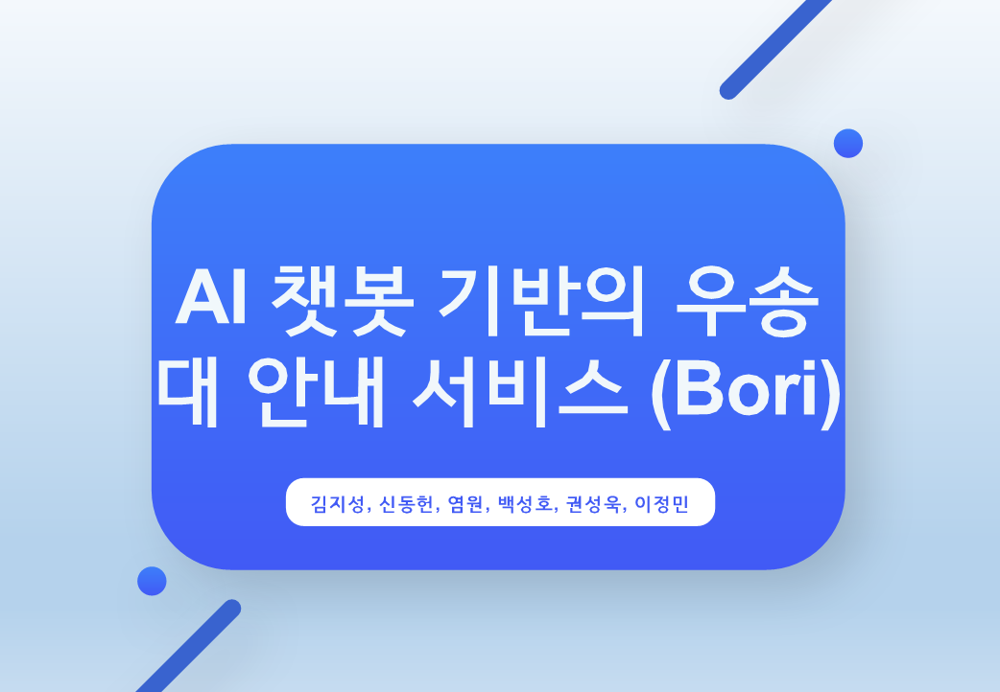

# 우송대 안내 서비스 Bori

   
  
   

목차
1. 프로젝트 소개
2. 팀원 소개
3. 설계의 주안점
4. 개발 환경
5. 구현 기능 
6. 구조도
7. 배운 점 & 아쉬운 점

## 프로젝트 소개

“학교의 시설 및 학사일정을 편하게 확인하자”

우송대학교 학생들의 설문조사를 토대로 조사한 결과 학교 시설의 대한 정보 및 학사일정을
찾는 과정이 간편하지 않다는 문제점이 존재한다. “Bori”서비스는 이러한 문제점을 해결한다.

우송대학교 안내 서비스인 “Bori”는 사용자가 질문하면
학습된 정보를 통해 답변하는 AI 기반의 서비스로
언제든지 내가 원하는 시설의 정보나 학사일정 등을 얻을 수 있다.

또한 시작 화면을 통해 우송대학교 소식 등을 확인할 수 있고 지도 페이지를 통해
우송대학교 시설들을 한 눈에 볼 수 있으며 AR을 통해 건물과 내 사이의 대략적인 거리를 알 수 있고 건물의 층별 안내도를 AR로 확인할 수 있다.

## 팀원 소개

팀원 소개

| # 김지성 | # 신동헌 |  # 염원   |  # 백성호           |
| :--------: | :--------: | :------: | :-----: |
|     역할    |   역할   | 역할 | 역할 |
|   챗봇 기능      |   지도 기능        |     지도 기능      |    관리자페이지 담당     |
|   AR 기능   |    디자인 총괄     |      NestJS API 기능       |   NestJS API      |
|   NestJS API     |    메인 페이지    |  관리자페이지 기능         |       |
|   Django API      |            |          |         |
|   AWS 환경 구축      |            |          |         |

| # 권성욱 | # 이정민 |
| :--------: | :--------: |
|   역할   |   역할    |
|   챗봇 디자인    |   메인 페이지 디자인    |

## 설계의 주안점
- 사용자 경험을 중시한 인터페이스
- 시작 화면에서 빠르게 우송대학교 소식과 같은 학교 정보를 확인할 수 있는 기능
- AI 챗봇을 통해 궁금한 정보를 빠르게 얻을 수 있는 기능
- AR 기능을 통해 학교 시설에 대한 정보를 얻을 수 있는 기능
- 지도를 통해 건물들의 정보를 정확하게 전달

 

## 개발 환경

   
  
   

 

## 구현 기능

### 메인 페이지

  학교의 소식들을 빠르게 확인하는 메인 페이지

   
  
   

### 챗봇 페이지

  사용자의 질문에 학습된 정보를 기반으로 답변하는 챗봇
  

   
  
   

### 지도 페이지

  여러 부가적인 기능으로 학교 시설들의 정보를 한 눈에 확인하는 지도 페이지
    

   
  
   

### AR

  내 위치에서 건물의 대략적인 방향과 건물의 층별 구조도를 확인 할 수 있는 AR기능
      

   
  
   

    

   
  
   

 
 ### QR
 
  QR을 인식해서 사용자에게 바로 3D 오브젝트를 보여주는 기능
  

    

   
  
   

 
 

## 배운 점 & 아쉬운 점

 

[typescript]: /readImage/icons8-typescript
[react]: /images/stack/react.svg
[node]: /images/stack/node.svg
[react-native]: /readImage/icons8-RN.svg

